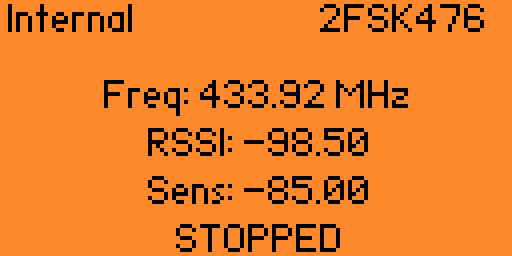

# Модификация приложения "Радио Сканер" для Flipper Zero

> Основано на [Flipper-Zero-Radio-Scanner](https://github.com/RocketGod-git/Flipper-Zero-Radio-Scanner) от RocketGod-git

---

## 🎯 Дополнения и изменения

### 1. Стартовая частота
При запуске приложения запрашивается начальная частота сканирования

*Возможность пропустить и использовать значение по умолчанию*

### 2. Выбор антенны
Добавлен запрос используемой антенны перед началом работы

⚠️ **Известная проблема:** При выборе внешней антенны без её физического подключения происходит сбой приложения

### 3. 📡 Добавлен выбор модуляции (3 пресета)
## !!! переключение пресетов производиться длительное нажатие вниз. 

### 4. При запуске сканирование не начинается сразу, а только после начатия на "Ок"
!!! напоминаю , что звук включается/выключается при длительном нажатии вверх

## 📥 Скачать version new (Download):

[**radio_scanner.fap**](https://github.com/ValeraVvV/Flipper-Zero-Radio-Scanner/raw/main/version_1/radio_scanner.fap)

*Скопируйте файл в папку `apps/subghz/` на SD-карте Flipper Zero*
